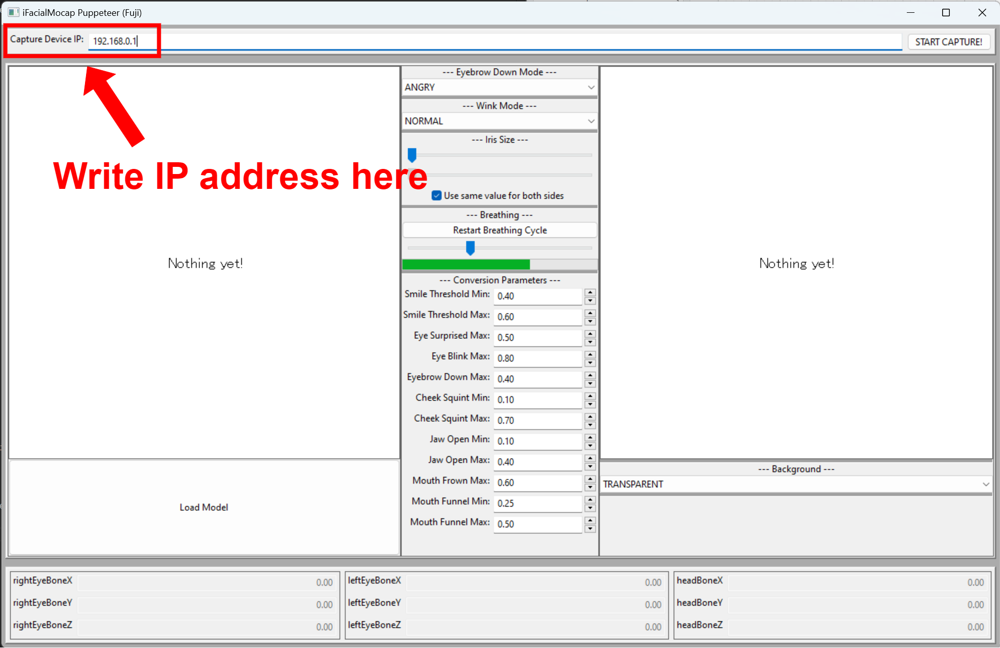
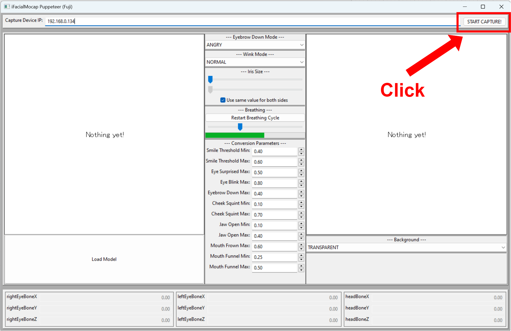
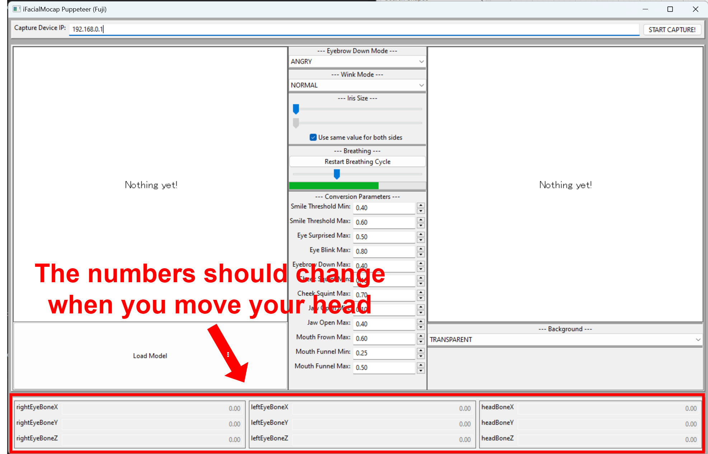

# `character_model_ifacialmocap_puppeteer`

This program allows the user to control trained student models with their facial movement, which is captured by the [iFacialMocap](https://www.ifacialmocap.com/) software. You can purchase the software from the App Store for 980 Japanese Yen.

## Invoking the Program

Make sure you have (1) created a Python environment and (2) downloaded model files as instruction in the [main README file](../README.md).

### Instruction for Linux/OSX Users

1. Open a shell.
2. `cd` to the repository's directory.
   ```
   cd SOMEWHERE/talking-head-anime-4-demo
   ```
3. Run the program.
   ```
   bin/run src/tha4/app/character_model_ifacialmocap_puppeteer.py
   ```   

### Instruction for Windows Users

1. Open a shell.
2. `cd` to the repository's directory.
   ```
   cd SOMEWHERE\talking-head-anime-4-demo
   ```
3. Run the program.
   ```
   bin\run.bat src\tha4\app\character_model_ifacialmocap_puppeteer.py
   ```

## Usage

1. Run iFacialMocap on your iOS device. It should show you the device's IP address. Jot it down. Keep the app open.

   

2. Invoke the `character_model_ifacialmocap_puppeteer` application.

3. You will see a text box with label "Capture Device IP." Write the iOS device's IP address that you jotted down there.

   

4. Click the "START CAPTURE!" button to the right.

   

   If the programs are connected properly, you should see the numbers in the bottom part of the window change when you move your head.

   

5. Now, you can load a student model, and the character should follow your facial movement.